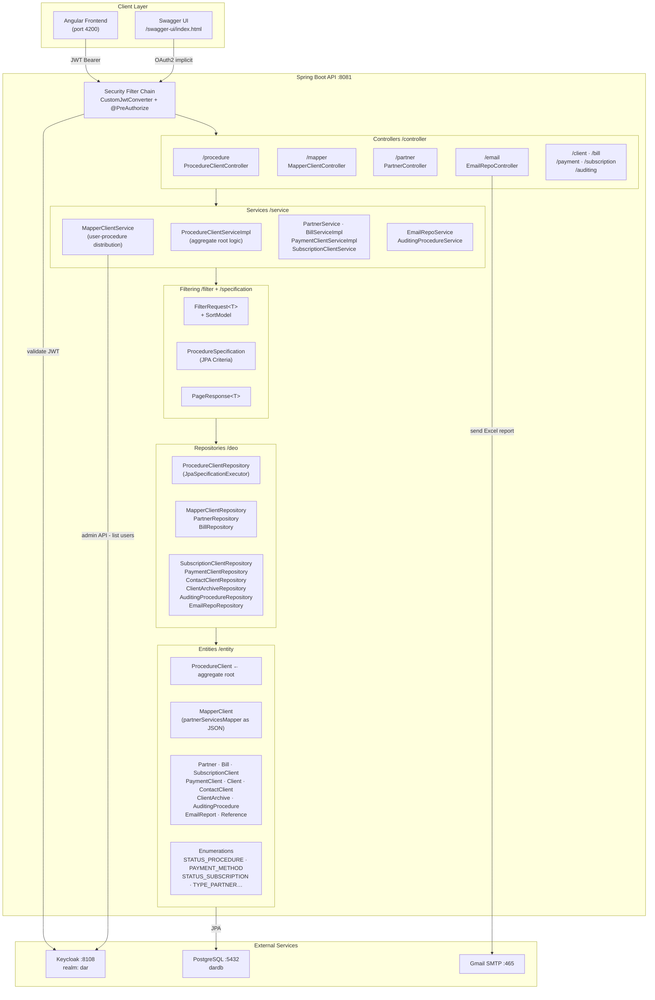

# DAR Backend — `dar_back`

> Spring Boot 3.2.1 · Java 17 · PostgreSQL · Keycloak · REST API for DAR ERP

---

## Table of Contents
1. [Tech Stack](#tech-stack)
2. [Architecture Diagram](#architecture-diagram)
3. [Quick Start](#quick-start)
4. [Repository Structure](#repository-structure)
5. [Business Logic Map](#business-logic-map)
6. [API Endpoints](#api-endpoints)
7. [Security & Roles](#security--roles)
8. [Conventions](#conventions)

---

## Tech Stack

| Layer | Technology | Version |
|---|---|---|
| Runtime | Java | 17 |
| Framework | Spring Boot | 3.2.1 |
| Persistence | Spring Data JPA + Hibernate | Boot-managed |
| Database | PostgreSQL | any (tested local 5432) |
| Auth / SSO | Keycloak (resource server + admin client) | 23.0.3 |
| API Docs | SpringDoc OpenAPI / Swagger UI | 2.2.0 |
| Error format | Zalando Problem (RFC 7807) | 0.27.0 |
| Email | Spring Mail + Gmail SMTP | Boot-managed |
| Async | Spring `@EnableAsync` + `ThreadPoolTaskExecutor` | Boot-managed |
| Build | Maven Wrapper (`mvnw`) | 3.x |
| Boilerplate | Lombok | Boot-managed |

---

## Architecture Diagram



---

## Quick Start

### Prerequisites
| Requirement | Version |
|---|---|
| JDK | 17+ |
| Maven (or use wrapper) | 3.6+ |
| PostgreSQL | any running on 5432 |
| Keycloak | 23.x running on 8108 |

### 1 — Configure environment
Edit `src/main/resources/application.properties`:
```properties
# Database
spring.datasource.url=jdbc:postgresql://localhost:5432/dardb
spring.datasource.username=postgres
spring.datasource.password=YOUR_PASSWORD

# Keycloak
spring.security.oauth2.resourceserver.jwt.issuer-uri=http://<KEYCLOAK_HOST>:8108/realms/dar
keycloak.auth-server-url=http://<KEYCLOAK_HOST>:8108
keycloak.realm=dar

# Mail
spring.mail.username=YOUR_GMAIL
spring.mail.password=YOUR_APP_PASSWORD
spring.mail.to=RECIPIENT_EMAIL
```

### 2 — Run
```bash
# Windows
mvnw.cmd spring-boot:run

# Unix / macOS
./mvnw spring-boot:run
```

### 3 — Use
| URL | Purpose |
|---|---|
| `http://localhost:8081/swagger-ui/index.html` | Interactive API docs (OAuth2 login) |
| `http://localhost:8081/procedure/**` | Core procedure operations |
| `http://localhost:8081/mapper/**` | User-to-procedure mapper management |
| `http://localhost:8081/partner/**` | Partner CRUD |
| `http://localhost:8081/email/**` | Email report management & sending |

### 4 — Build & test
```bash
mvnw.cmd clean package      # build fat JAR → target/core-0.0.1-SNAPSHOT.jar
mvnw.cmd test               # runs contextLoads smoke test
```

---

## Repository Structure

```
dar_back/
├── pom.xml                                  # Maven build + dependency management
├── mvnw / mvnw.cmd                          # Maven wrappers
├── src/
│   ├── main/
│   │   ├── resources/
│   │   │   └── application.properties       # All runtime config (DB, Keycloak, mail)
│   │   └── java/com/darelkheera/group/core/
│   │       ├── DarelkheeraApplication.java  # Entry point (@SpringBootApplication)
│   │       │
│   │       ├── controller/                  # HTTP layer — one file per domain
│   │       │   ├── ProcedureClientController.java
│   │       │   ├── MapperClientController.java
│   │       │   ├── PartnerController.java
│   │       │   ├── BillController.java
│   │       │   ├── PaymentClientController.java
│   │       │   ├── SubscriptionClientController.java
│   │       │   ├── ClientController.java
│   │       │   ├── ClientArchiveController.java
│   │       │   ├── AuditingProcedureController.java
│   │       │   ├── EmailRepoController.java
│   │       │   └── errors/                  # RFC7807 ExceptionTranslator
│   │       │
│   │       ├── service/                     # Business logic — role-aware
│   │       │   ├── ProcedureClientServiceImpl.java  ← main orchestrator
│   │       │   ├── MapperClientService.java
│   │       │   ├── PartnerService.java
│   │       │   ├── BillServiceImpl.java
│   │       │   ├── PaymentClientServiceImpl.java
│   │       │   ├── SubscriptionClientService.java
│   │       │   ├── AuditingProcedureServiceImpl.java
│   │       │   ├── EmailRepoService.java
│   │       │   └── ProCalculator.java       # Bill total recalculation helper
│   │       │
│   │       ├── deo/                         # Repositories (legacy package name)
│   │       │   ├── ProcedureClientRepository.java  ← JpaSpecificationExecutor
│   │       │   ├── MapperClientRepository.java
│   │       │   ├── PartnerRepository.java
│   │       │   ├── BillRepository.java
│   │       │   ├── SubscriptionClientRepository.java
│   │       │   ├── PaymentClientRepository.java
│   │       │   ├── ContactClientRepository.java
│   │       │   ├── ClientArchiveRepository.java
│   │       │   ├── AuditingProcedureRepository.java
│   │       │   └── EmailRepoRepository.java
│   │       │
│   │       ├── entity/                      # JPA entities
│   │       │   ├── ProcedureClient.java     ← aggregate root
│   │       │   ├── MapperClient.java        ← JSON-column partnerServicesMapper
│   │       │   ├── Partner.java
│   │       │   ├── Bill.java
│   │       │   ├── SubscriptionClient.java
│   │       │   ├── PaymentClient.java
│   │       │   ├── Client.java
│   │       │   ├── ContactClient.java
│   │       │   ├── ClientArchive.java
│   │       │   ├── AuditingProcedure.java
│   │       │   ├── EmailReport.java
│   │       │   ├── Reference.java
│   │       │   ├── dto/                     # Request/response DTOs
│   │       │   └── enumeration/             # STATUS_PROCEDURE, PAYMENT_METHOD, …
│   │       │
│   │       ├── filter/                      # Generic paging wrapper
│   │       │   ├── FilterRequest.java       # pageNo, pageSize, filterModel, sortModel
│   │       │   └── SortModel.java
│   │       │
│   │       ├── specification/
│   │       │   └── ProcedureSpecification.java  # JPA Criteria predicates
│   │       │
│   │       ├── mapper/
│   │       │   └── ProcedureMapper.java     # Entity → DTO static helpers
│   │       │
│   │       ├── security/
│   │       │   ├── SecurityConfig.java      # Filter chain + Keycloak bean
│   │       │   └── CustomJwtConverter.java  # Merges realm_access.roles into authorities
│   │       │
│   │       └── comfig/                      # Config beans (legacy package name)
│   │           ├── MapToJsonConverter.java  # Map<String,Set<String>> ↔ JSON column
│   │           ├── OpenAPISecurityConfig.java
│   │           ├── MultiThreading.java      # ThreadPoolTaskExecutor (5–10 threads)
│   │           └── CustomZonedDateTimeConverter.java
│   │
│   └── test/
│       └── DarelkheeraApplicationTests.java # contextLoads smoke test only
```

---

## Business Logic Map

### Core Entities and Relationships
```
Partner ──< ProcedureClient >── MapperClient (user)
                │
                ├──< Bill >── SubscriptionClient
                ├──< AuditingProcedure          (immutable change log)
                └──< Client (many-to-many)
```

### Key Flows

| Flow | Entry Point | Service Method | Notes |
|---|---|---|---|
| Create / update procedure | `PUT /procedure/procedureclient` | `ProcedureClientServiceImpl#save` | Auto-sets user from JWT, appends audit record |
| Search procedures (paged) | `POST /procedure/procedure-clients-by-partner/search` | `getProClientByPartnerSearch` | `FilterRequest` → `ProcedureSpecification` → `PageResponse` |
| Add bill to procedure | `PUT /procedure/bill` | `addBill` | Updates `totalBillsAu`/`totalBillsEx` on `SubscriptionClient`, calls `ProCalculator` |
| Assign procedures to users | `POST /mapper/mapper` | `MapperClientService#saveMapper` | Distributes quota per partner+service across user list |
| Lookup phone/archive | `GET /procedure/Phone/{natId}` | `findAllPhoneByClientNat` | Cross-references `ContactClient` + `ClientArchive` by national ID and bigkey |
| Send Excel report email | `POST /email/send-excel` | `EmailRepoController` direct | Decodes base64 attachment, sends via `JavaMailSender` |

### Role-based branching pattern (used in every service)
```java
Authentication auth = SecurityContextHolder.getContext().getAuthentication();
if (auth.getAuthorities().stream().anyMatch(a -> a.getAuthority().equals("ROLE_ADMIN"))) {
    // full data access
} else {
    // scope to current user via MapperClient.partnerServicesMapper
}
```

---

## API Endpoints

| Method | Path | Role | Description |
|---|---|---|---|
| `PUT` | `/procedure/procedureclient` | any auth | Create/update a procedure |
| `GET` | `/procedure/procedureclient/{id}` | any auth | Get procedure by ID |
| `POST` | `/procedure/procedure-clients-by-partner/search` | any auth | Filtered + paged search |
| `PUT` | `/procedure/bill` | any auth | Attach/update bill on procedure |
| `GET` | `/procedure/partners/by/user` | `ROLE_USER` | Partners visible to current user |
| `GET` | `/partner/**` | `ROLE_ADMIN` / `ROLE_USER` | Partner CRUD |
| `GET` | `/mapper/mappers` | `ROLE_SUBADMIN` | List all mapper assignments |
| `POST` | `/mapper/mapper` | `ROLE_SUBADMIN` | Bulk assign procedures to users |
| `PUT` | `/mapper/mapper` | `ROLE_SUBADMIN` | Update a single mapper |
| `GET` | `/mapper/allusername` | `ROLE_SUBADMIN` | Unmapped Keycloak usernames |
| `POST` | `/email/email` | `ROLE_USER` | Save email report record |
| `POST` | `/email/send-excel` | `ROLE_SUBADMIN` | Email Excel attachment |
| `GET` | `/payment/**` | `ROLE_ADMIN` / `ROLE_USER` | Payment operations |

---

## Security & Roles

| Role | Level | Access |
|---|---|---|
| `ROLE_ADMIN` | Full | All data across all partners/users |
| `ROLE_GROUP` | Group | Data across a group of users |
| `ROLE_SUBADMIN` | Management | Mapper, partner write, email reports |
| `ROLE_USER` | Scoped | Own procedures + mapped partner/service quota |

- Roles come from Keycloak `realm_access.roles` via `CustomJwtConverter`.
- Broad routes (`/mapper/**`, `/partner/**`, `/client/**`, `/swagger-ui/**`) are permit-all at the filter chain; fine-grained control is via `@PreAuthorize` per method.
- Keycloak realm: **dar** — configured in `application.properties`.

---

## Conventions

- **Legacy packages** — `deo` (repositories) and `comfig` (config beans) are intentional; do not rename.
- **Search endpoints** — always use `FilterRequest<DTO>` body → `Specification` → `PageResponse<DTO>` return.
- **Repository queries** — JPQL constructor projection first; native SQL only when joins/aggregates are impractical in JPQL.
- **JSON column** — `MapperClient.partnerServicesMapper` (`Map<String, Set<String>>`) is stored as a JSON string via `MapToJsonConverter`; always load through the `@Convert` annotation.
- **Audit trail** — every mutating operation on `ProcedureClient` must append an `AuditingProcedure` record before saving.
- **Error responses** — throw `BadRequestAlertException` in controllers; `ExceptionTranslator` converts to RFC7807 JSON automatically.
---

## What I Built

I designed and developed the full backend system for **DAR ERP** from scratch as a solo backend engineer.

### 🏗️ Core System Architecture
- Designed a layered Spring Boot architecture: **Controller → Service → Repository → Entity** with clean domain separation across 10+ business modules.
- Built a generic **filtering + pagination engine** (`FilterRequest<T>` + `ProcedureSpecification` + `PageResponse<T>`) reusable across all search endpoints.
- Implemented an **audit trail system** — every mutation on a `ProcedureClient` automatically appends an immutable `AuditingProcedure` record with user, action type, timestamp, and description.

### 🔐 Security & Identity
- Integrated **Keycloak** as the identity provider — configured the app as an OAuth2 resource server validating JWTs from realm `dar`.
- Built a custom **`CustomJwtConverter`** that merges standard Spring authorities with Keycloak `realm_access.roles`, enabling role-based branching (`ROLE_ADMIN`, `ROLE_GROUP`, `ROLE_SUBADMIN`, `ROLE_USER`) throughout all services.
- Mixed security strategy: broad permit-all routes at the filter chain + fine-grained `@PreAuthorize` per controller method.

### 📋 Procedure & Business Logic
- Built the **`ProcedureClient` aggregate root** — the central entity tying together partners, clients, bills, subscriptions, and audit history.
- Implemented **role-aware data scoping**: admins see all data; regular users see only their assigned procedures via `MapperClient.partnerServicesMapper`.
- Built `ProCalculator` — a helper that recalculates total payment amounts on a procedure every time a bill is added or updated.

### 🗺️ Mapper Distribution Engine
- Built `MapperClientService#saveMapper` — a quota distribution algorithm that takes a list of users and distributes unassigned procedures across them proportionally by partner + service, with remainder handling for the last user in the list.
- Stored the partner-service mapping as a **JSON column** (`Map<String, Set<String>>`) using a custom `MapToJsonConverter` JPA attribute converter.
- Wired Keycloak **admin API** into `MapperClientService#getAllUserName` to list unmapped users directly from the realm.

### 💰 Billing & Payments
- Implemented bill attachment logic that splits totals by payment method (`CASH_OFFICE`, `CASH_PARTNER` vs. external) and updates `totalBillsAu` / `totalBillsEx` on the related `SubscriptionClient`.
- Built `PaymentClientServiceImpl` and `BillServiceImpl` handling the full payment lifecycle.

### 📞 Phone & Archive Lookup
- Built a multi-source phone lookup (`findAllPhoneByClientNat`) that cross-references `ContactClient` and `ClientArchive` by national ID and a compound `bigkey`, deduplicating results into a single `PhoneDTO` response.

### 📧 Email Reporting
- Built `EmailRepoController#sendExcel` — accepts a base64-encoded Excel file from the frontend, decodes it, attaches it to a `MimeMessage`, and sends it via Gmail SMTP over SSL (port 465).

### 🗄️ Persistence & Queries
- Wrote all **JPQL DTO constructor projections** across 10 repositories — projecting only needed fields into DTOs instead of loading full entities.
- Used native SQL selectively (e.g. `findAllProByMapperIdAndUserAct`) where multi-table joins were impractical in JPQL, backed by `@SqlResultSetMapping` on `ProcedureClient`.

### 🔧 Infrastructure & Config
- Configured **Hibernate batch inserts** (batch size 5000, ordered inserts/updates) for high-volume procedure loads.
- Set up a `ThreadPoolTaskExecutor` (5–10 threads) for async operations via `@EnableAsync`.
- Configured **Zalando Problem** (RFC 7807) error format so all API errors return structured JSON consumed by the Angular frontend.
- Wired **SpringDoc OpenAPI** with OAuth2 implicit flow so the Swagger UI authenticates against Keycloak directly.
---

## Author

| | |
|---|---|
| **Name** | Yazan Abuawwad |
| **Email** | [yazanabuawwad@outlook.com](mailto:yazanabuawwad@outlook.com) |
| **GitHub** | [@Yazan-Abuawwad](https://github.com/Yazan-Abuawwad) |

> Created and maintained by **Yazan Abuawwad** — DAR ERP Backend.

