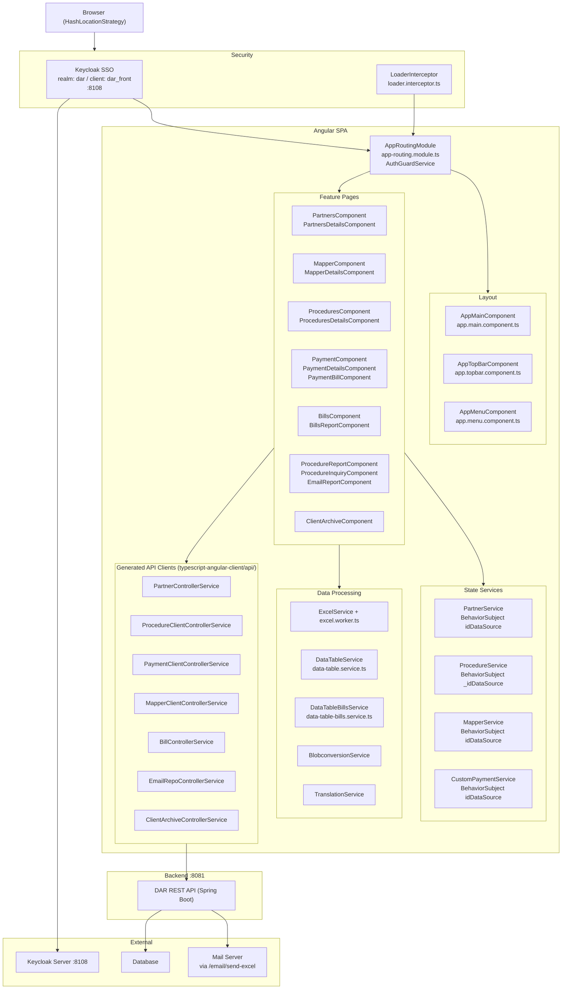

# dar-front

> Angular 16 front-end for the **Dar Al-Kheera** debt-collection case management platform — partners, procedures, payments, billing, and reporting in one SSO-protected SPA.

---

## Table of Contents

1. [Tech Stack](#tech-stack)
2. [Architecture Diagram](#architecture-diagram)
3. [Quick Start](#quick-start)
4. [Repository Structure](#repository-structure)
5. [Business Logic Map](#business-logic-map)
6. [API Endpoints](#api-endpoints)
7. [Security & Roles](#security--roles)
8. [Conventions](#conventions)
9. [What I Built](#what-i-built)
10. [Author](#author)

---

## Tech Stack

| Layer | Technology | Version |
|---|---|---|
| Framework | Angular | 16.1.x |
| UI Component Library | PrimeNG + PrimeFlex + PrimeIcons | 16.9.x / 3.3.x / 6.0.1 |
| Auth / SSO | Keycloak Angular + Keycloak JS | 14.4.0 / 18.0.1 |
| HTTP Client | Angular HttpClient (generated by OpenAPI Generator) | — |
| State Management | RxJS BehaviorSubject (no NgRx) | 7.8.x |
| i18n | @ngx-translate/core + http-loader | 15.0.0 / 8.0.0 |
| Excel Import | XLSX (SheetJS) + exceljs + Web Worker | 0.18.5 / 4.4.x |
| PDF Export | jsPDF + jspdf-autotable | 2.5.x / 3.8.x |
| File Download | file-saver | 2.0.x |
| Icons | FontAwesome (angular-fontawesome) | 0.13.x |
| Calendar | FullCalendar (Angular adapter) | 6.0.x |
| Date Utilities | date-fns | 3.3.x |
| Routing | Angular Router (hash strategy) | 16.1.x |
| Build Tooling | Angular CLI + TypeScript | 16.1.5 / 5.1.x |
| Testing | Karma + Jasmine | 6.4.x / 4.6.x |
| Code Gen | OpenAPI Generator CLI (`awwadiapi` npm script) | — |

---

## Architecture Diagram



---

## Quick Start

### Prerequisites

| Requirement | Version | Notes |
|---|---|---|
| Node.js | 18.x or 20.x | LTS recommended |
| npm | 9.x+ | bundled with Node |
| Angular CLI | 16.1.5 | `npm i -g @angular/cli@16.1.5` |
| Keycloak | 18.x | Running at `http://81.21.8.180:8108`, realm `dar`, client `dar_front` |
| DAR Backend API | v1 | Running at `http://81.21.8.180:8081` |

### Steps

1. **Install dependencies**
   ```bash
   npm install
   ```

2. **Configure environment**

   Edit `src/environments/environment.ts` for development:
   ```typescript
   export const environment = {
     production: false,
     apiUrl: 'http://192.168.100.20:4200',      // SPA origin (used for SSO redirect)
     backend: 'http://81.21.8.180:8081',         // Spring Boot API
     keycloak: {
       authority: 'http://81.21.8.180:8108',
       redirectUri: 'http://192.168.100.20:4200',
       postLogoutRedirectUri: 'http://192.168.100.20:4200',
       realm: 'dar',
       clientId: 'dar_front'
     }
   };
   ```

   Edit `src/app/app.module.ts` → `initializeKeycloak()` to match your Keycloak URL if different from `http://81.21.8.180:8108`.

3. **Regenerate the API client** (when the backend API changes)
   ```bash
   npm run awwadiapi
   # Runs: openapi-generator-cli generate
   #        -i http://81.21.8.180:8081/v3/api-docs
   #        -g typescript-angular
   #        -o src/app/typescript-angular-client
   ```

4. **Run the development server**
   ```bash
   npm start        # ng serve
   ```

### URLs

| Purpose | URL |
|---|---|
| Dev SPA | `http://localhost:4200/#/` |
| Keycloak Admin | `http://81.21.8.180:8108` |
| Backend Swagger | `http://81.21.8.180:8081/swagger-ui.html` |
| Backend API docs | `http://81.21.8.180:8081/v3/api-docs` |

### Build & Test

```bash
npm run build      # ng build → dist/
npm test           # ng test (Karma + Jasmine)
npm run lint       # ng lint
```

---

## Repository Structure

```
dar_front/
├── angular.json                     # Build targets, asset config, style paths
├── package.json                     # Dependencies; npm scripts: start/build/test/awwadiapi
├── tsconfig.json                    # Base TypeScript config
├── tsconfig.app.json                # App-specific TS config
├── tsconfig.worker.json             # Web Worker TS config (for excel.worker.ts)
├── openapitools.json                # OpenAPI Generator version pin (7.x)
│
└── src/
    ├── index.html                   # Shell HTML — loads <app-root>
    ├── main.ts                      # Bootstrap: platformBrowserDynamic().bootstrapModule(AppModule)
    ├── styles.scss                  # Global SCSS entry
    │
    ├── environments/
    │   ├── environment.ts           # Dev: backend=:8081, keycloak=:8108, apiUrl=:4200
    │   └── environment.prod.ts      # Prod: same hosts, production=true
    │
    ├── assets/
    │   ├── silent-check-sso.html    # Keycloak silent SSO iframe target
    │   ├── i18n/
    │   │   ├── en.json              # English translation keys (50+ keys incl. all status enums)
    │   │   └── ar.json              # Arabic translation keys (RTL support)
    │   ├── layout/                  # PrimeNG layout CSS and images
    │   └── theme/                   # PrimeNG theme assets
    │
    └── app/
        ├── app.module.ts            # Root NgModule: 30+ declarations, Keycloak APP_INITIALIZER,
        │                            #   LoaderInterceptor, HashLocationStrategy
        ├── app.component.ts         # app-root: renders <app-main>
        ├── app.config.ts            # Standalone bootstrap config (provideRouter)
        │
        ├── appRouting/
        │   └── app-routing.module.ts  # All routes behind AuthGuardService; hash routing; 20+ paths
        │
        ├── main/
        │   ├── app.main.component.ts  # app-main: menu modes (overlay/static/horizontal), RTL toggle
        │   └── app.main.component.html
        │
        ├── appTopBar/
        │   └── app.topbar.component.ts  # Username from KeycloakService.getUsername();
        │                                #   canvas-drawn initials avatar; logout
        ├── AppMenu/
        │   ├── app.menu.component.ts    # Role-conditional menu: ROLE_ADMIN sees full menu,
        │   │                            #   others see only Procedures + Inquiry
        │   └── app.menu.service.ts      # Subject<string> bus for menu item activation
        ├── appMenuitem/
        │   └── app.menuitem.component.ts
        ├── appBreadcrumb/
        │   ├── app.breadcrumb.component.ts
        │   └── app.breadcrumb.service.ts
        ├── appFooter/
        │   └── app.footer.component.ts
        ├── appRightPanel/
        │   └── app.rightpanel.component.ts
        ├── appConfig/
        │   └── app.config.component.ts  # Theme switcher panel
        │
        ├── models/                      # View-model interfaces (hand-written, not generated)
        │   ├── mapper-VM.ts             # MapperVM { id, userName[], subscriptionClients[], description }
        │   ├── subscription-table.ts    # SubscriptionTable { id, partner, service }
        │   └── tableVM.ts              # TableVM { clientCode, clientNat, mainAccount, name, ... }
        │
        ├── services/                    # Hand-written Angular services
        │   ├── app.login.service.ts     # Auth helpers (wraps KeycloakService)
        │   ├── authinterceptor.service.ts  # Legacy bearer interceptor (disabled; superseded by keycloak-angular)
        │   ├── loader.interceptor.ts    # LoaderInterceptor: show/hide spinner on every HTTP call via finalize()
        │   ├── loader.service.ts        # BehaviorSubject<boolean> for global spinner state
        │   ├── partner.service.ts       # PartnerService: BehaviorSubject(id), viewFlag, refreshFlag
        │   ├── procedure.service.ts     # ProcedureService: BehaviorSubject(id)
        │   ├── mapper.service.ts        # MapperService: BehaviorSubject(id), viewFlag
        │   ├── custom-payment.service.ts  # CustomPaymentService: BehaviorSubject(id), viewFlag, refreshFlag
        │   ├── data-table.service.ts    # Excel→PartnerDTO mapper; BehaviorSubjects for mapping/data/rootObject
        │   ├── data-table-bills.service.ts  # Excel→PaymentDTO mapper for bills import
        │   ├── excel.service.ts         # readExcel (headers only), readEntireSheet (full data + date handling),
        │   │                            #   readEntireSheetBills (no date conversion)
        │   ├── excel.worker.ts          # Web Worker: XLSX parsing off the main thread
        │   └── blobconversion.service.ts  # Converts HTTP Blob responses → JSON via .text()/JSON.parse()
        │
        ├── translation/
        │   └── translation.service.ts   # Wraps TranslateService; setLanguage('en'|'ar')
        │
        ├── typescript-angular-client/   # AUTO-GENERATED — do not edit (regenerate with npm run awwadiapi)
        │   ├── api/                     # One service file per backend controller (11 files)
        │   │   ├── partnerController.service.ts
        │   │   ├── procedureClientController.service.ts
        │   │   ├── paymentClientController.service.ts
        │   │   ├── mapperClientController.service.ts
        │   │   ├── billController.service.ts
        │   │   ├── emailRepoController.service.ts
        │   │   ├── clientArchiveController.service.ts
        │   │   ├── subscriptionClientController.service.ts
        │   │   ├── clientController.service.ts
        │   │   ├── auditingProcedureController.service.ts
        │   │   └── helloController.service.ts
        │   ├── model/                   # Generated DTOs: PartnerDTO, ProcedureClient, PaymentDTO, ...
        │   ├── configuration.ts         # basePath injection token; bearer token credential lookup
        │   ├── api.module.ts            # ApiModule — provides all generated services
        │   └── encoder.ts              # CustomHttpParameterCodec
        │
        └── pages/                       # Feature page components
            ├── partners/
            │   ├── partners.component.ts          # app-partners: list with CSV/Excel/PDF export
            │   └── partners-details/
            │       ├── partners-details.component.ts  # Excel upload → column mapping → PartnerDTO save
            │       └── data-table/
            │           └── data-table.component.ts    # Inline preview of mapped Excel data
            ├── mapper/
            │   ├── mapper.component.ts            # app-mapper: list, create, edit, view, delete
            │   └── mapper-details/
            │       └── mapper-details.component.ts  # User + partner + service selection → MapperClient[]
            ├── procedures/
            │   ├── procedures.component.ts        # app-procedures: role-filtered list, advanced search,
            │   │                                  #   WhatsApp link, phone lookup via national ID
            │   ├── procedures-details/
            │   │   └── procedures-details.component.ts  # Full procedure: status machine, bills,
            │   │                                         #   contacts, audit trail
            │   └── inquiry-details/
            │       └── inquiry-details.component.ts    # Read-only procedure view (new window)
            ├── payment/
            │   ├── payment.component.ts           # app-payment: payment list with status column
            │   ├── payment-details/
            │   │   └── payment-details.component.ts  # Excel upload → BillsExcDTO → PaymentDTO save
            │   └── payment-bill/
            │       └── payment-bill.component.ts  # Editable bill rows; ISO ↔ display date conversion
            ├── bills/
            │   └── bills.component.ts             # Date + partner filter; column selector
            ├── bills-report/
            │   └── bills-report.component.ts      # BillReportDTO grid
            ├── procedure-report/
            │   └── procedure-report.component.ts  # ProcedureReportDTO grid by partner + date range
            ├── procedure-inquiry/
            │   ├── procedure-inquiry.component.ts # Read-only list → opens /inquiry-details/:id in new tab
            │   └── inquiry-details/
            │       └── inquiry-details.component.ts
            ├── email-report/
            │   └── email-report.component.ts      # Select rows → XLSX → base64 → POST /email/send-excel
            ├── client.archive/
            │   └── client.archive.component.ts    # Archived client list, bulk delete
            ├── date-range-filter/
            │   └── date-range-filter.component.ts # Reusable p-calendar date range picker
            ├── loader/
            │   └── loader.component.ts            # app-loader: p-progressSpinner fed by LoaderService
            ├── appLogin/
            ├── appError/
            ├── appNotfound/
            └── appAccessdenied/
```

---

## Business Logic Map

### Entity Relationship Sketch

```
Partner  (PartnerTypeEnum: Banks | Companies)
  └─── ClientExcelDTO[]  (uploaded via Excel → DataTableService.generateRootObject())
         ├─── SubscriptionClient[]  (msdn, cat, deposit, handSet, packageTermination...)
         └─── ProcedureClient  (one debt-collection case per client)
                ├─── status: NEW → CONTACT → APPOINTMENT → RECLAIM
                │             → FINAL_SETTLEMENT | INSTALLMENT_SETTLEMENT
                │             → OFFICE_RECONCILIATION | PARTNER_RECONCILIATION
                │             → DRAINED | RECONCILIATION_COURT_CASE
                │             → RECONCILIATION_CASE_OFFICE | NOT_DEMANDING | JUDICIAL_TRANSFER
                ├─── Bill[]              (partial payment records; amount, paymentMethod, status)
                ├─── ContactClient[]     (phone numbers; ACTIVE | NOT_ACTIVE | DEFAULTED)
                ├─── AuditingProcedure[] (immutable status-change audit log)
                └─── ClientArchive       (prior case history selected when status = NEW)

MapperClient
  └─── partnerServicesMapper: { partnerName → string[] }   (partner→services assignment)
  └─── userName  (Keycloak username of the assigned agent)
  └─── group / description

PaymentDTO
  └─── BillsExcDTO[]  (tpy, customer_Code, account_Code, msisdn — from bills Excel)
  └─── payment_method: CASH_OFFICE | CASH_PARTNER | EFAWATEERCOM |
                       BANK_DEPOSIT | TRANSFER | BANK_CHECK | OTHER

EmailReport  (backend-generated; exported to Excel and sent via /email/send-excel)
```

### Key Flows

| Flow | Entry Point | Service / Method | Notes |
|---|---|---|---|
| Partner Excel Import | `PartnersDetailsComponent` | `ExcelService.readEntireSheet()` → `DataTableService.generateRootObject()` → `PartnerControllerService.createPartner()` | Dates auto-converted from Excel serial; Arabic text preserved; nested JSON notes |
| Bills Excel Import | `PaymentDetailsComponent` | `ExcelService.readEntireSheetBills()` → `DataTableBillsService.generateRootObject()` → `PaymentClientControllerService.refreshPaymentClient()` | No date conversion; fields: tpy, customer_Code, account_Code, msisdn |
| Procedure Search | `ProceduresComponent.searchProcedures()` | `ProcedureClientControllerService.getAllByPartnerSearch(FilterRequestProcedureFilterDTO)` | Filters: partner, service, fromDateProInsert, toDateProInsert, fromTotal, toTotal |
| Procedure Status Update | `ProceduresDetailsComponent` | `ProcedureClientControllerService.updateProcedureClient(ProcedureClient)` | Status enum drives UI section visibility |
| WhatsApp Contact | `ProceduresComponent.sendMessage()` | `window.open('wa.me/<phone>')` | Phone resolved first via `getPhoneByNatId(clientNat)` → `PhoneDTO` |
| Email Report Send | `EmailReportComponent.exportAndSend()` | `XLSX.utils.json_to_sheet()` → `btoa()` → `EmailRepoControllerService.sendExcel({ base64Data })` | Sends to `/email/send-excel` |
| Mapper Create | `MapperDetailsComponent.onSubmit()` | `MapperClientControllerService.createMapperClient(MapperClient[])` | Groups services per partner with `Set<string>` reduce |
| Procedure Inquiry (new tab) | `ProcedureInquiryComponent.onRowSelect()` | `window.open(environment.apiUrl + '/#/inquiry-details/' + id, '_blank')` | Read-only view in separate browser tab |
| Global Loading Spinner | `LoaderInterceptor.intercept()` | `LoaderService.show()` then `finalize(() => LoaderService.hide())` | Every HTTP call triggers spinner automatically |
| SSO Bootstrap | `APP_INITIALIZER` in `app.module.ts` | `KeycloakService.init({ onLoad: 'check-sso', silentCheckSsoRedirectUri })` | Runs before Angular renders any route |

### Role-Branching Code Pattern

```typescript
// src/app/AppMenu/app.menu.component.ts
ngOnInit() {
  if (this.authGuard.hasROLE_ADMIN()) {
    this.model = [
      { label: 'Dashboard',          routerLink: ['/'] },
      { label: 'Partners',           routerLink: ['/partners'] },
      { label: 'Mappers',            routerLink: ['/mapper'] },
      { label: 'Procedures',         routerLink: ['/procedures'] },
      { label: 'Payments',           routerLink: ['/payment'] },
      { label: 'Bills',              routerLink: ['/bills'] },
      { label: 'Bills Report',       routerLink: ['/bills-report'] },
      { label: 'Procedure Report',   routerLink: ['/procedure-report'] },
      { label: 'Archive',            routerLink: ['/archive'] },
      { label: 'Procedures Inquiry', routerLink: ['/procedure-inquiry'] },
      { label: 'Email Report',       routerLink: ['/email-report'] },
    ];
  } else {
    this.model = [
      { label: 'Dashboard',          routerLink: ['/'] },
      { label: 'Procedures',         routerLink: ['/procedures'] },
      { label: 'Procedures Inquiry', routerLink: ['/procedure-inquiry'] },
    ];
  }
}
```

```typescript
// src/app/pages/procedures/procedures.component.ts
ngOnInit() {
  if (!this.authGuard.hasROLE_ADMIN()) {
    // Agents see only their own cases
    this.procedureClientControllerService.getAllByUser().subscribe(...);
  }
  // Admins can also call getAllByPartner(partnerId) or getAllByPartnerSearch(filter)
}
```

---

## API Endpoints

All requests target `http://81.21.8.180:8081`. Bearer tokens are injected automatically by `keycloak-angular` (`enableBearerInterceptor: true` in `app.module.ts`). All clients live in `src/app/typescript-angular-client/api/`.

### Partner — `PartnerControllerService`

| Method | Path | Role | Description |
|---|---|---|---|
| GET | `/partner/partners` | ADMIN | List all partners |
| GET | `/partner/partner/{id}` | ADMIN | Get partner by ID |
| POST | `/partner/partner` | ADMIN | Create partner with bulk `ClientExcelDTO[]` |
| PUT | `/partner/update` | ADMIN | Update existing partner |
| POST | `/partner/refresh` | ADMIN | Re-sync partner data |
| DELETE | `/partner/partner/{id}` | ADMIN | Delete partner |

### Procedure — `ProcedureClientControllerService`

| Method | Path | Role | Description |
|---|---|---|---|
| GET | `/procedure/procedureclientbyuser` | ALL | Procedures assigned to current user |
| GET | `/procedure/procedure-clients-by-partner/{id}` | ADMIN | All procedures for a partner |
| POST | `/procedure/procedure-clients-by-partner/search` | ADMIN | Advanced search (`FilterRequestProcedureFilterDTO`) |
| GET | `/procedure/procedureclient/{id}` | ALL | Full procedure details |
| GET | `/procedure/procedureclient/count` | ALL | Count procedures for current user |
| PUT | `/procedure/procedureclient` | ALL | Update procedure (status, notes, subscriptions) |
| PUT | `/procedure/bill` | ALL | Add bill to procedure (`BillDTO`) |
| PUT | `/procedure/phone` | ALL | Add phone to procedure (`PhoneDTO`) |
| GET | `/procedure/Phone/{natId}` | ALL | Get `PhoneDTO` by national ID |
| GET | `/procedure/partners/by/user` | ALL | Partners available to current user |
| GET | `/procedure/service/{partnerId}` | ALL | Services list for a partner |
| GET | `/procedure/UserMappedByProId/{id}` | ADMIN | Agent username mapped to a procedure |
| GET | `/procedure/pro-report/{start}/{end}/{partnerId}` | ADMIN | `ProcedureReportDTO` list |
| GET | `/procedure/client/archive` | ALL | Client archive entries for procedure |
| DELETE | `/procedure/procedureclient` | ADMIN | Delete all procedures |

### Payment — `PaymentClientControllerService`

| Method | Path | Role | Description |
|---|---|---|---|
| GET | `/payment/payments` | ADMIN | List all payments |
| GET | `/payment/payment/{id}` | ADMIN | Get single payment |
| POST | `/payment/create` | ADMIN | Create new payment |
| POST | `/payment/refresh` | ADMIN | Upsert payment from Excel (`PaymentDTO`) |
| PUT | `/payment/update` | ADMIN | Update payment |

### Mapper — `MapperClientControllerService`

| Method | Path | Role | Description |
|---|---|---|---|
| GET | `/mapper/mappers` | ADMIN | List all mapper clients |
| GET | `/mapper/mapper/{id}` | ADMIN | Get mapper by ID |
| POST | `/mapper/mapper` | ADMIN | Create mapper client(s) array |
| DELETE | `/mapper/mapper/{id}` | ADMIN | Delete mapper |
| GET | `/mapper/partners` | ADMIN | Partners available for mapping |
| GET | `/mapper/allusername` | ADMIN | All Keycloak usernames |
| GET | `/mapper/services/{partnerId}` | ADMIN | Services for a partner |
| GET | `/mapper/subscriptions/{partnerId}` | ADMIN | Subscriptions for a partner |
| GET | `/mapper/subscriptions/{partnerId}/{service}` | ADMIN | Subscriptions filtered by partner + service |

### Bills — `BillControllerService`

| Method | Path | Role | Description |
|---|---|---|---|
| GET | `/bill/bills/{start}/{end}/{partner}` | ADMIN | Bills filtered by date range + partner name |
| GET | `/bill/report/bills/{start}/{end}/{partner}` | ADMIN | `BillReportDTO` list for reporting |

### Email Report — `EmailRepoControllerService`

| Method | Path | Role | Description |
|---|---|---|---|
| GET | `/email/emails` | ADMIN | All email reports |
| GET | `/email/email` | ADMIN | Single email report |
| DELETE | `/email/delete/{id}` | ADMIN | Delete one email report |
| DELETE | `/email/delete/all/` | ADMIN | Bulk delete email reports |
| POST | `/email/send-excel` | ADMIN | Send XLSX as email (base64 request body) |

### Client Archive — `ClientArchiveControllerService`

| Method | Path | Role | Description |
|---|---|---|---|
| GET | `/client_archive/clients` | ALL | All archived clients |
| GET | `/client_archive/ClientArchive` | ALL | Client archive detail |
| PUT | `/client_archive/update` | ADMIN | Update archive record |

### Subscriptions — `SubscriptionClientControllerService`

| Method | Path | Role | Description |
|---|---|---|---|
| GET | `/subscription/subscriptions` | ALL | All subscription clients |
| GET | `/subscription/subscription/{id}` | ALL | Get subscription by ID |

### Auditing — `AuditingProcedureController`

| Method | Path | Role | Description |
|---|---|---|---|
| GET | `/auditing/auditingprocedure` | ADMIN | All audit records |
| GET | `/auditing/auditingprocedure/{id}` | ADMIN | Audit record by ID |
| GET | `/auditing/auditingprocedure/count` | ADMIN | Count audit entries |

### Client / Health — `ClientController` / `HelloController`

| Method | Path | Role | Description |
|---|---|---|---|
| GET | `/client/clients` | ADMIN | All clients |
| GET | `/client/client/{id}` | ADMIN | Get client by ID |
| POST | `/client/client` | ADMIN | Create client |
| GET | `/api/hello` | PUBLIC | Health check |
| GET | `/api/prime/file` | PUBLIC | Static file endpoint |

---

## Security & Roles

| Role | Access Level | Pages / Features |
|---|---|---|
| `ROLE_ADMIN` | Full access | All pages: Partners, Mappers, Procedures (all), Payments, Bills, Reports, Archive, Email Report, advanced search and all exports |
| _(non-admin authenticated user)_ | Restricted | Dashboard, Procedures (own cases only via `/procedure/procedureclientbyuser`), Procedure Inquiry |

### How Roles Are Resolved

1. **`APP_INITIALIZER`** in `src/app/app.module.ts` calls `KeycloakService.init()` with `onLoad: 'check-sso'` before the app renders. Unauthenticated users are redirected to Keycloak login at `http://81.21.8.180:8108`.
2. **`AuthGuardService`** is applied to every feature route in `src/app/appRouting/app-routing.module.ts`. It blocks navigation if the Keycloak session is invalid.
3. **`KeycloakService.isUserInRole('ROLE_ADMIN')`** (`authGuard.hasROLE_ADMIN()`) is called:
   - In `AppMenuComponent.ngOnInit()` to build the correct sidebar menu (11 items vs. 3 items).
   - In `ProceduresComponent.ngOnInit()` to choose between `getAllByUser()` and `getAllByPartner()`.
4. **Bearer token** is automatically appended to every `HttpClient` request by the `keycloak-angular` built-in interceptor (`bearerPrefix: 'Bearer'`). The legacy `AuthinterceptorService` is present in `services/authinterceptor.service.ts` but disabled.
5. **Silent SSO** keeps sessions alive using the `/assets/silent-check-sso.html` iframe page (`checkLoginIframe: false`; `silentCheckSsoRedirectUri` set to `window.location.origin + '/assets/silent-check-sso.html'`).

---

## Conventions

- **Hash routing** — `HashLocationStrategy` is registered in `app.module.ts`. All routes are prefixed `/#/`. The `environment.apiUrl` value is used when constructing cross-tab navigation links (e.g., `window.open(environment.apiUrl + '/#/inquiry-details/' + id)`).
- **BehaviorSubject state pattern** — Every feature list+detail pair shares one hand-written service (`PartnerService`, `ProcedureService`, `MapperService`, `CustomPaymentService`). Each holds the selected `id` as a `BehaviorSubject<number>` and `viewFlag`/`refreshFlag` booleans. The detail component subscribes to `currentIdData` in `ngOnInit()` to load the correct record.
- **Navigation convention** — The list component calls `service.updateId(entity.id)` and optionally `service.updateViewFlag(true/false)` **before** `router.navigate([...])`. The detail component reads those flags on load to decide read-only vs. edit mode.
- **Generated API clients** — The 11 services under `typescript-angular-client/api/` are fully regenerated by `npm run awwadiapi` from the live Swagger at `:8081/v3/api-docs`. Never edit those files manually; changes will be overwritten.
- **Blob response handling** — Several endpoints return a raw `Blob`. `BlobconversionService` converts them to usable JSON via `.text()` then `JSON.parse()`.
- **Excel serial date conversion** — `ExcelService.handleExcelSerial()` converts numeric Excel dates (days since 1900-01-01) to ISO strings. `readEntireSheetBills()` intentionally skips this because bills have no date columns.
- **Date display format** — All components format display dates as `MM/dd/yyyy` using a local `formatDate` helper. API request/response dates are ISO 8601 UTC strings.
- **i18n pattern** — All user-facing labels use `{{ 'KEY' | translate }}` with keys maintained in `assets/i18n/en.json` and `ar.json`. RTL layout switches automatically when Arabic is selected via `AppMainComponent.onRTLChange()` calling `TranslationService.setLanguage('ar')`.
- **Procedure status is a 13-value string enum** — `ProcedureClient.StatusEnum` covers `NEW`, `CONTACT`, `APPOINTMENT`, `RECLAIM`, `FINAL_SETTLEMENT`, `INSTALLMENT_SETTLEMENT`, `OFFICE_RECONCILIATION`, `PARTNER_RECONCILIATION`, `DRAINED`, `RECONCILIATION_COURT_CASE`, `RECONCILIATION_CASE_OFFICE`, `NOT_DEMANDING`, `JUDICIAL_TRANSFER`. All i18n keys match these exact uppercase strings.
- **Payment method enum** — `PaymentDTO.PaymentMethodEnum` has 7 values: `CASH_OFFICE`, `CASH_PARTNER`, `EFAWATEERCOM`, `BANK_DEPOSIT`, `TRANSFER`, `BANK_CHECK`, `OTHER`.
- **PartnerType enum** — `PartnerDTO.PartnerTypeEnum`: `Banks`, `Companies`.
- **Web Worker for Excel parsing** — `excel.worker.ts` is compiled under `tsconfig.worker.json`. `ExcelService.readExcel()` spawns it via `new Worker(new URL('../services/excel.worker', import.meta.url))` to avoid blocking the UI thread during large `.xlsx` file reads.
- **Global loading spinner** — `LoaderInterceptor` calls `LoaderService.show()` at request start and `hide()` in a `finalize()` pipe operator so the spinner always clears even on error. `LoaderComponent` (`app-loader`) renders a `p-progressSpinner` gated by `*ngIf="loaderService.isLoading | async"`.
- **Responsive breakpoints** — `AppMainComponent` exposes three inline helpers using `window.innerWidth`: `isMobile()` (≤ 640 px), `isTablet()` (641–1024 px), `isDesktop()` (> 992 px).
- **Canvas avatar** — `AppTopBarComponent.generateAvatar()` draws the user's first+last initials onto an off-screen `<canvas>` and returns a `data:image/png` URL used as the profile image in the topbar.

---

## What I Built

### 🤝 Partners & Excel Import Pipeline
Built the complete Excel-to-database import flow: `PartnersComponent` (paginated list with CSV/Excel/PDF export via `jsPDF`/`XLSX`), `PartnersDetailsComponent` (file upload + column-mapping dialog), `DataTableComponent` (interactive column mapper), and `DataTableService` (maps raw sheet rows to `PartnerDTO` + `ClientExcelDTO[]` with nested `clientNote`/`subNote` as JSON strings). Handled Arabic text preservation and Excel serial date conversion in `ExcelService`, with XLSX parsing offloaded to `excel.worker.ts` to keep the UI responsive.

### 🗺️ Mapper Assignment
Built `MapperComponent` (list, delete with confirmation dialog) and `MapperDetailsComponent` where an admin selects Keycloak users, selects partners, then picks services per partner. The `onSubmit()` method uses a `Set<string>` reduce to build the `partnerServicesMapper: { [partner]: string[] }` objects and POSTs a `MapperClient[]` array to `/mapper/mapper`.

### ⚖️ Procedures & Case Management
Built role-aware `ProceduresComponent` (admins see all cases; agents see only their own via `/procedure/procedureclientbyuser`) with advanced search using `FilterRequestProcedureFilterDTO` (partner, service, date range, min/max total claim). Added phone lookup from national ID, WhatsApp deep-link generation via `sendMessage()`, and date formatting via a local `formatDate` helper. Built `ProceduresDetailsComponent` with a full 13-state status machine, bill management (`addBill()`), phone/contact management (`addPhone()`), `ClientArchive` selection on `NEW` status, and `AuditingProcedure` trail display.

### 📋 Procedure Inquiry (Read-Only Portal)
Built `ProcedureInquiryComponent` with status and date filters that opens procedure detail as `window.open(environment.apiUrl + '/#/inquiry-details/' + id, '_blank')`. `InquiryDetailsComponent` shows the full read-only procedure including the mapped agent name fetched from `/procedure/UserMappedByProId/{id}` (returns a `Blob` decoded by `BlobconversionService`).

### 💳 Payments & Bills Import
Built `PaymentComponent` (list with status), `PaymentDetailsComponent` (Excel upload using `readEntireSheetBills()` — no date conversion — mapping to `BillsExcDTO` via `DataTableBillsService`), and `PaymentBillComponent` (editable bill row table with `convertDateProInsertToISO()` / `convertISOToDateProInsert()` helpers).

### 📊 Reports
Built three reporting views: `BillsComponent` (date range + partner filter, multi-column display selector), `BillsReportComponent` (`BillReportDTO` grid with columns procedureId, userAct, codePro, clientName, service, expectAmount, amount, status_procedure), and `ProcedureReportComponent` (`ProcedureReportDTO` grid by partner ID + date range via `/procedure/pro-report/{start}/{end}/{partnerId}`).

### 📧 Email Report Export
Built `EmailReportComponent`: loads all records from `/email/emails`, lets the user select rows via PrimeNG table checkbox, builds an XLSX workbook with `XLSX.utils.json_to_sheet()`, encodes it to base64 via `btoa()`, and POSTs `{ base64Data: string }` to `/email/send-excel`.

### 🔐 Auth & Layout Infrastructure
Wired Keycloak `APP_INITIALIZER` in `app.module.ts` with silent SSO (`silentCheckSsoRedirectUri`), registered `LoaderInterceptor` for a global HTTP spinner, built role-conditional `AppMenuComponent`, canvas-avatar topbar via `KeycloakService.getUsername()` + `generateAvatar()`, and bilingual RTL toggle in `AppMainComponent.onRTLChange()`.

### 🌐 Full Bilingual (EN / AR) Support
Implemented English/Arabic switching with `@ngx-translate` using `assets/i18n/en.json` and `ar.json`. RTL layout activates via `AppMainComponent` when Arabic is selected. All 13 procedure statuses, 7 payment methods, and 2 contact statuses have translated labels in both languages.

---

## Author

| Field | Value |
|---|---|
| Name | Yazan Abu Awwad |
| Email | [yazanabuawwad@outlook.com](mailto:yazanabuawwad@outlook.com) |
| GitHub | [@Yazan-Abuawwad](https://github.com/Yazan-Abuawwad) |

> Built the entire Dar Al-Kheera front-end from scratch — from Keycloak SSO wiring and Excel import pipelines to multi-state case management and bilingual Arabic/English reporting.
